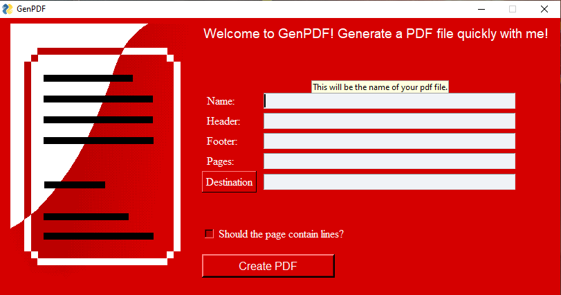
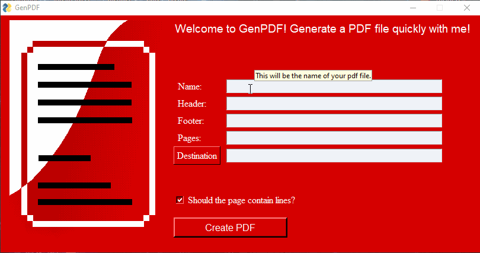
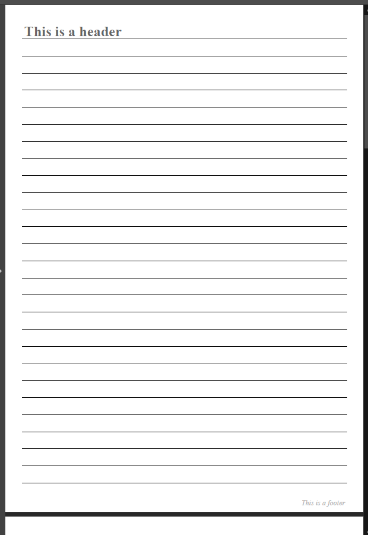

# About GenPDF:
I created this app for a wider audience, giving it a functional gui design for desktop use.
You can generate blank PDF files with multiple pages given some predefined guidelines.

For companies who would run it internally or people who would use only the srcipt, please refer to this repo:

https://github.com/Nandras993/PDF_creator

### How it looks:

 
### Usage:

### Result:

